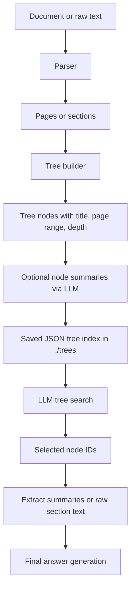

# CloakTree

CloakTree is CloakPipe’s **vectorless retrieval mode** for a **single structured document**.

Instead of turning a document and a query into embeddings and doing nearest-neighbor search in a vector database, CloakTree builds a **local tree index** of the document and asks an LLM to **reason over that tree** to decide which sections matter.

In this repository, CloakTree lives mainly in `crates/cloakpipe-tree` and is exposed through:

- the CLI: `cloakpipe tree ...`
- the proxy’s tree routes: `/tree/...`

This document describes the **current source behavior** in this repo, not just the higher-level product spec.

## What “vectorless LLM-driven retrieval” means here

CloakTree removes the classic vector-RAG steps:

- no embedding generation
- no vector database
- no query embedding
- no cosine similarity search

Instead, the pipeline is:

1. Parse a document into pages or sections.
2. Build a hierarchy of nodes from headings or fallback chunks.
3. Optionally summarize each node with an LLM.
4. Ask an LLM which nodes look relevant to a question.
5. Extract content from the selected nodes.
6. Ask an LLM to answer from that extracted context.

In other words, the LLM acts as the **retrieval planner**, not just the final answer generator.

## The mental model

Think of CloakTree as an **LLM-readable table of contents with summaries**.

A vector pipeline says:

> “Find the chunks whose embeddings are closest to this query embedding.”

CloakTree says:

> “Here is the structure of the document. Which sections should we inspect to answer this question?”

That makes it a better fit for:

- annual reports
- contracts
- policies
- regulatory filings
- manuals
- other documents with headings, sections, and a stable structure

It is a worse fit for:

- large multi-document corpora
- messy chat logs
- loosely structured notes
- highly semantic fuzzy retrieval across many unrelated files

## How the current code works



### 1. Parsing

The parser is in `crates/cloakpipe-tree/src/parser.rs`.

Current support in code:

- `.pdf`
- `.md`
- `.txt`

Current behavior:

- **PDF**: text is extracted with `pdf_extract`; pages are split on form-feed characters when available.
- **Markdown**: sections are split using simple `#`, `##`, `###`, ... heading parsing.
- **Text**: `.txt` goes through the same text parser as Markdown, so it only becomes structured if it uses Markdown-style headings.

Important limitations:

- There is **no DOCX or HTML parser in the current code**, even though some higher-level docs mention them.
- PDF parsing is text-extraction only. There is **no OCR** for scanned PDFs.
- If PDF extraction does not preserve page breaks, the parser may treat the whole PDF as a single page.
- Raw text sent to the HTTP text endpoint is **not re-parsed for headings**; it becomes a single synthetic page.

### 2. Tree building

The indexer is in `crates/cloakpipe-tree/src/indexer.rs`.

It uses one of two strategies:

#### Heading-based tree

If headings are found, the indexer:

- creates one node per heading
- assigns a depth from the heading level
- uses a stack to nest child sections under parent sections

Each node stores:

- `id`
- `title`
- `summary`
- `pages`
- `children`
- `depth`

#### Page-based fallback

If no headings are found, the indexer creates generic sections:

- `Section 1`
- `Section 2`
- ...

Each fallback section covers up to `max_pages_per_node` pages.

### 3. Summarization

If `tree.add_node_summaries = true`, the indexer sends each node’s text to the configured LLM and stores a 2-3 sentence summary.

It also generates a one-sentence document description from the first part of the navigation map.

By default, both indexing and search use the same upstream style as the rest of CloakPipe:

- upstream URL from `[proxy].upstream`
- API key from `[proxy].api_key_env`
- default model: `gpt-4o`

### 4. Search

The searcher is in `crates/cloakpipe-tree/src/search.rs`.

It turns the tree into a navigation map such as:

- node ID
- title
- pages
- optional summary
- indentation by depth

Then it prompts an LLM to return JSON with the most relevant node IDs.

There are two search paths:

- **small tree** (`<= 30` navigation entries): one search call over the full navigation map
- **larger tree**: intended as iterative search

### 5. Extraction and answering

There are two slightly different behaviors depending on which surface you use:

- `ContentExtractor` in `crates/cloakpipe-tree/src/extractor.rs` can extract the **raw text** for selected nodes from parsed pages.
- the HTTP search handlers mostly return the stored **node summaries**, not raw extracted section text.

That difference matters in practice and is explained in the caveats below.

## What the tree index looks like

Tree indices are stored as local JSON files by `crates/cloakpipe-tree/src/storage.rs`.

Default location:

- `./trees/`

File name pattern:

- `./trees/<uuid>.json`

Each saved index includes:

- tree ID
- source path or source name
- description
- total pages
- child nodes
- creation timestamp
- model name
- pseudonymized flag

The core struct is `TreeIndex` in `crates/cloakpipe-tree/src/tree.rs`.

## What CloakTree eliminates, and what it does not

### What it eliminates today

Compared with vector RAG, the current implementation does remove:

- embedding API calls
- query embeddings
- vector database storage
- embedding inversion risk

### What it does **not** eliminate today

The current implementation still makes LLM calls for:

- node summarization during indexing
- document description generation during indexing
- tree search itself
- final answer generation

So the current code is best understood as:

> **vectorless retrieval**, not **LLM-free retrieval**.

That distinction matters.

## Privacy model: design goal vs current implementation

The crate docs describe CloakTree as privacy-first and mention pseudonymized summaries. That is the direction of the design.

But in the current source:

- `tree.pseudonymize_summaries` exists in config
- `NodeSummary` has a `pseudonymized` field
- `TreeIndex` has a `pseudonymized` field

However, the actual indexing code currently stores summaries with:

- `pseudonymized: false`
- no vault-based pseudonymization step

So today you should treat CloakTree as:

- vectorless
- local-storage-based
- LLM-assisted
- **not yet fully privacy-hardened at the summary layer**

## When you should use CloakTree

Use CloakTree when all of these are mostly true:

- you are working with **one document at a time**
- that document has a recognizable structure
- headings and sections matter
- you want reasoning over document structure, not just chunk similarity
- you want to avoid embeddings and vector databases

Good examples:

- annual report Q&A
- contract review
- policy lookup
- compliance document analysis
- technical manual question answering

## When you should not use CloakTree

Avoid it when any of these are true:

- you need retrieval across many documents
- your data is mostly unstructured text blobs
- your files are scans that need OCR
- you need robust fuzzy semantic retrieval across a corpus
- you need guaranteed pseudonymization inside the tree index today

In those cases, CloakVector is the better mental model.

## How to use CloakTree from the CLI

The CLI entrypoints are defined in `crates/cloakpipe-cli/src/main.rs` and implemented in `crates/cloakpipe-cli/src/commands.rs`.

### Prerequisites

CloakTree uses the configured upstream LLM for indexing and search.

At minimum, set the environment variable named by `[proxy].api_key_env`.

By default that is:

- `OPENAI_API_KEY`

And make sure `[proxy].upstream` points at an OpenAI-compatible chat-completions endpoint.

### 1. Build an index

```bash
cloakpipe tree index /absolute/path/to/report.pdf
```

This:

- parses the file
- builds the tree
- optionally generates summaries
- saves a JSON file under `tree.storage_path`
- prints the tree ID, node count, depth, page count, and saved path

### 2. List available tree indices

```bash
cloakpipe tree list
```

This lists saved IDs and source documents from the storage directory.

### 3. Inspect a tree

```bash
cloakpipe tree show ./trees/<tree-id>.json
```

This prints:

- source
- model
- page count
- node count
- depth
- created timestamp
- document description
- the full navigation map

### 4. Search an existing tree

```bash
cloakpipe tree search ./trees/<tree-id>.json "What changed in operating margin?"
```

This returns:

- reasoning text from the search LLM
- optional confidence
- matching node IDs
- matching node titles, page ranges, and summaries

### 5. Run the full end-to-end query flow

```bash
cloakpipe tree query /absolute/path/to/report.pdf "What were the key revenue drivers?"
```

This command:

1. builds the tree if needed
2. searches it
3. extracts raw text from selected nodes
4. asks the LLM to answer from those excerpts

If you pass an existing JSON index instead of a document path:

```bash
cloakpipe tree query ./trees/<tree-id>.json "What were the key revenue drivers?"
```

then the CLI loads the saved tree and **re-parses the original source file** named inside the index.

That means the original source document must still exist at the same path stored in the JSON index.

## How to use CloakTree over HTTP

The proxy routes are defined in `crates/cloakpipe-proxy/src/server.rs` and handled in `crates/cloakpipe-proxy/src/tree_handlers.rs`.

Current routes:

- `POST /tree/index`
- `POST /tree/index/file`
- `GET /tree/list`
- `GET /tree/{id}`
- `POST /tree/{id}/search`
- `POST /tree/query`
- `DELETE /tree/{id}`

### Start the proxy

```bash
cloakpipe start
```

### Build an index from a server-side file path

```json
POST /tree/index/file
{
  "file_path": "/absolute/path/to/report.pdf"
}
```

Important detail:

- this endpoint expects a file path on the machine running the proxy
- it does **not** upload a file via multipart form data

### Build an index from inline text

```json
POST /tree/index
{
  "name": "report.txt",
  "text": "..."
}
```

Use this only when you understand the current limitation:

- inline text is indexed as a single synthetic page
- the text path does not build a rich heading-based tree today

### Search a saved tree

```json
POST /tree/{id}/search
{
  "query": "What changed in operating margin?"
}
```

This returns:

- `node_ids`
- `reasoning`
- `confidence`
- `extracted`

In the current HTTP implementation, `extracted[].text` is usually the node’s **stored summary**, not raw section text.

### Get a final answer

```json
POST /tree/query
{
  "tree_id": "<tree-id>",
  "query": "What changed in operating margin?"
}
```

Or build from inline text and answer in one shot:

```json
POST /tree/query
{
  "name": "report.txt",
  "text": "...",
  "query": "What changed in operating margin?"
}
```

In the current HTTP implementation, the final answer is built mainly from the **stored node summaries**, not from a fresh raw-text extraction pass.

## Configuration knobs that exist today

The config struct is `TreeConfig` in `crates/cloakpipe-core/src/config.rs`.

```toml
[tree]
enabled = true
storage_path = "./trees/"
index_model = "gpt-4o"
search_model = "gpt-4o"
max_pages_per_node = 10
max_tokens_per_node = 20000
add_node_summaries = true
pseudonymize_summaries = true
```

What each one does today:

- `enabled`: declared in config, but not currently used to gate routes
- `storage_path`: where JSON tree indices are stored
- `index_model`: model used for node summaries and document description
- `search_model`: model used for tree search and final answering
- `max_pages_per_node`: fallback chunk size and cap for heading-based node ranges
- `max_tokens_per_node`: rough character-based truncation limit before summarization
- `add_node_summaries`: if false, skip node summaries
- `pseudonymize_summaries`: present in config, but not wired into indexing yet

## Source-grounded caveats you should know

These are the details most likely to surprise you if you only read the higher-level spec.

### Search is shallower than the design suggests

`TreeSearcher` is written as if large trees will be searched over multiple rounds.

In the current implementation:

- small trees get one full-map search call
- large trees do one top-level reasoning pass
- the code may append immediate children of selected nodes
- then it stops

So today, large-tree search behaves more like a **shallow guided selection** than a full recursive tree walk.

### Node IDs are flat, not dotted paths

Comments in `tree.rs` mention IDs like `1.2.3`, but the indexer currently assigns IDs as flat sequential strings:

- `1`
- `2`
- `3`
- ...

That is fine for lookup, but it is worth knowing when you inspect results.

### Heading-based nodes are capped by page range

In heading mode, each node’s page range is capped by `max_pages_per_node`.

That means a long section may be truncated to only part of the span between one heading and the next.

### `--no-summaries` is not truly offline

The CLI help says `--no-summaries` skips LLM-generated summaries.

That part is true, but the indexer still generates the **document description** with an LLM call.

So `--no-summaries` reduces LLM usage, but it does not make indexing fully offline.

### The HTTP search and query paths use summaries heavily

In the proxy handlers:

- `/tree/{id}/search` returns summary text as the extracted content
- `/tree/query` also builds answer context from saved summaries

If you want raw section text extraction, the CLI `tree query` path is currently closer to that behavior.

### Raw text endpoints do not build a rich tree

`build_index_from_text()` wraps incoming text as a single page with no headings.

So if you want actual section-aware retrieval, prefer file-based indexing over inline text.

### `tree.enabled` is not enforced today

The router mounts the tree routes directly.

So `tree.enabled = false` is currently descriptive config, not access control.

### Some docs in the repo are ahead of the code

Higher-level docs mention features such as:

- DOCX parsing
- HTML parsing
- pseudonymized summaries
- deeper tree navigation
- `/v1/tree/...` endpoints

The current implementation is narrower:

- PDF, Markdown, and text files
- non-pseudonymized summaries
- `/tree/...` endpoints
- shallow LLM-guided search

## Recommended way to use CloakTree today

For the current codebase, the safest workflow is:

1. Use a **structured file** such as a PDF or Markdown document.
2. Build an index from the file path, not from inline text.
3. Inspect the tree with `show` before trusting retrieval quality.
4. Use `search` first to see which nodes the LLM selects.
5. Use `query` only after the tree structure looks sane.
6. Prefer CloakTree for **single-document analysis**, not as a replacement for a corpus-wide RAG system.

A good practical sequence is:

```bash
cloakpipe tree index /absolute/path/to/document.pdf
cloakpipe tree show ./trees/<tree-id>.json
cloakpipe tree search ./trees/<tree-id>.json "your question"
cloakpipe tree query ./trees/<tree-id>.json "your question"
```

## CloakTree vs CloakVector

Use **CloakTree** when you want:

- one-document retrieval
- structure-aware reasoning
- no embeddings
- no vector DB

Use **CloakVector** when you want:

- corpus-wide retrieval
- chunk similarity search
- fuzzy semantic matching across many files
- more conventional RAG behavior

A simple rule:

- **one structured document** -> CloakTree
- **many messy documents** -> CloakVector

## Bottom line

CloakTree in this repo is a **local tree index + LLM navigation** system.

It is already useful for structured, single-document retrieval, especially when you want to avoid embeddings and vector databases.

But the current implementation is also clearly a **work in progress**:

- it is vectorless, not LLM-free
- summary pseudonymization is not wired yet
- inline-text indexing is shallow
- large-tree navigation is shallower than the design implies
- the HTTP path relies on summaries more than raw extraction

If you use it with those constraints in mind, it is a solid fit for structured document Q&A today.
